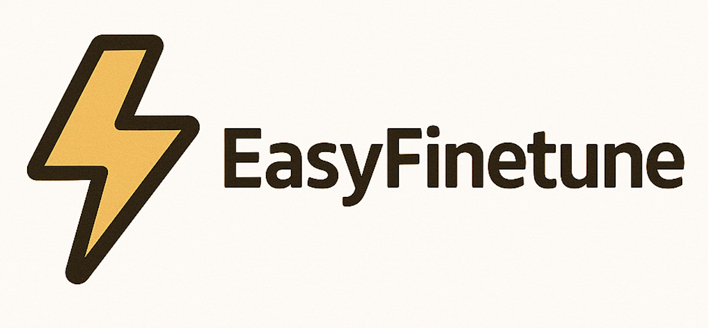

# EasyFinetune

EasyFinetune is a simple toolkit to help you fine-tune large language models (LLMs) using your own documents.

## It includes:

- 🛠️ A data generation tool to turn raw documents into structured training data (instruction, input, output)
- 🧠 A training script powered by Unsloth for fast and memory-efficient fine-tuning
- No complex setup. Just bring your documents, and start fine-tuning!
- 📚 A quantization toolkit to quantize the fine-tuned model to lower memory usage and faster inference

## Features

- Convert plain text or documents into training-ready format
- Supports Alpaca-style instruction tuning
- Uses Unsloth for fast and efficient training (LoRA, QLoRA, etc.)
- Works with popular LLMs like Mistral, Llama, etc.
- Minimal config, easy to use

## Generate training data

Please refer to [Generate Training Data](generate_data/docs/generate_data.md) for more details.

## Finetune-LLM-Unsloth

Please refer to [LLM Tutorial](ft_unsloth/docs/get_started_llm.md) for more details.

> Using RTX 4000ada, train dataset with 1000 pairs dataset, finetune for 3 epochs, using ~8GB vRAM, cost ~17 minutes.

## Finetune-VLM-Unsloth

Please refer to [VLM Tutorial](ft_unsloth/docs/get_started_vlm.md) for more details.

> Using RTX 4000ada, train dataset with 200 pairs dataset, finetune for 10 epochs, using ~8GB vRAM, cost ~20 minutes.

## Quantization

Using vllm or llama.cpp to do quantization

VLLM:
Please refer to [vllm-Quantization](quantization/docs/get_started-vllm.md)

llama.cpp:
Please refer to [llama-cpp-Quantization](quantization/docs/get_started-llama-cpp.md)

# Roadmap

- [X] Quantization toolkit
- [X] Generate data from Huggingface models
- [ ] Generate training data using RAG
- [ ] Inference toolkit
- [ ] Generate data for VLM models
- [ ] VLM GGUF Quantization